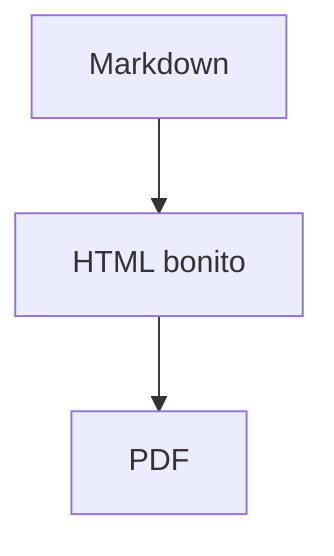

# Markdown Pretty Viewer

Aplicación gráfica local y multiplataforma para convertir documentación Markdown en HTML bonito y exportarla a PDF.

Está pensada para documentación técnica generada por Codex u otras herramientas que produzcan archivos `.md` o `.markdown`.

## Características principales

- Una sola base de código para macOS y Windows.
- Aplicación gráfica local con PySide6 / Qt.
- Vista HTML interna con `QWebEngineView`.
- Conversión Markdown → HTML completamente local.
- Exportación del documento seleccionado a PDF.
- Nombre editable al exportar PDF/HTML mediante diálogo nativo de guardado.
- Recuerda la última carpeta Markdown, el último archivo abierto y la última carpeta de exportación.
- Exportación secundaria a HTML.
- Sin Flask.
- Sin servidor local.
- Sin backend.
- Sin base de datos.
- Sin cuentas de usuario.
- Sin conexión a internet.
- Sin APIs externas.
- No modifica los archivos Markdown originales.

## Estructura del proyecto

```text
markdown-pretty-viewer/
├── app.py
├── requirements.txt
├── README.md
├── .gitignore
├── build_app.sh
├── build_windows.bat
├── MarkdownPrettyViewer-macOS.spec
├── MarkdownPrettyViewer-Windows.spec
├── assets/
│   ├── styles.css
│   ├── icon.png
│   ├── icon.icns
│   └── icon.ico
├── templates/
│   └── document.html
├── markdown_pretty_viewer/
│   ├── __init__.py
│   ├── config.py
│   ├── file_scanner.py
│   ├── main.py
│   ├── markdown_renderer.py
│   ├── paths.py
│   ├── settings.py
│   ├── ui.py
│   ├── web_security.py
│   └── workers.py
└── .github/
    └── workflows/
        └── build.yml
```

## Arquitectura

La app está separada en módulos sencillos:

- `ui.py`: ventana principal, botones, lista de archivos y exportación.
- `markdown_renderer.py`: conversión Markdown → HTML y plantilla final.
- `file_scanner.py`: búsqueda y lectura de archivos `.md` / `.markdown`.
- `web_security.py`: bloqueo de recursos externos para mantener la app local.
- `workers.py`: renderizado en segundo plano para documentos grandes.
- `config.py`: configuración centralizada.
- `paths.py`: rutas compatibles con desarrollo y PyInstaller.
- `settings.py`: preferencias persistentes de usuario mediante `QSettings`.

## Requisitos

- Python 3.10 o superior. Recomendado: Python 3.12.
- macOS o Windows.
- pip.

Dependencias principales:

- PySide6.
- Python-Markdown.
- pymdown-extensions.
- PyInstaller.

## Ejecutar en desarrollo

### macOS

```bash
python3 -m venv .venv
source .venv/bin/activate
pip install --upgrade pip
pip install -r requirements.txt
python app.py
```

### Windows

```bat
python -m venv .venv
.venv\Scripts\activate.bat
python -m pip install --upgrade pip
python -m pip install -r requirements.txt
python app.py
```

## Generar app para macOS

Desde macOS:

```bash
chmod +x build_app.sh
./build_app.sh
```

Resultado:

```text
dist/Markdown Pretty Viewer.app
```

La app se puede abrir con doble clic desde Finder.

## Generar app para Windows

Desde Windows:

```bat
build_windows.bat
```

Resultado:

```text
dist\Markdown Pretty Viewer\Markdown Pretty Viewer.exe
```

El `.exe` se puede abrir con doble clic.

## GitHub Actions

El repositorio incluye este workflow:

```text
.github/workflows/build.yml
```

Compila automáticamente:

- macOS: genera `MarkdownPrettyViewer-macOS.zip` con la `.app` dentro.
- Windows: genera `MarkdownPrettyViewer-Windows.zip` con la carpeta del ejecutable dentro.

Se ejecuta automáticamente en:

- `push` a `main` o `master`.
- Pull requests.
- Ejecución manual desde la pestaña **Actions**.
- Tags que empiecen por `v`, por ejemplo `v1.0.0`.

## Crear una release automática

Cuando quieras publicar una versión:

```bash
git tag v1.0.0
git push origin v1.0.0
```

GitHub Actions compilará macOS y Windows, y creará una Release con los ZIP listos para descargar.

## Uso de la aplicación

1. Abre la app.
2. La app intentará cargar automáticamente la última carpeta Markdown utilizada.
3. Si no hay carpeta previa o quieres cambiar de proyecto, pulsa **Seleccionar carpeta**.
4. Elige una carpeta con archivos `.md` o `.markdown`.
5. Selecciona un archivo de la lista lateral.
6. Revisa el documento renderizado como HTML.
7. Pulsa **Exportar PDF**.
8. Se abrirá un diálogo de guardado nativo con:
   - la última carpeta de exportación utilizada,
   - un nombre sugerido a partir del Markdown,
   - el nombre editable antes de guardar.
9. Guarda el PDF.

Ejemplo:

```text
migration-master-plan.md → migration-master-plan.pdf
```

Puedes cambiar el nombre antes de guardar, por ejemplo:

```text
01 - Introducción.pdf
02 - Arquitectura.pdf
03 - Despliegue.pdf
```

La app recuerda:

- la última carpeta Markdown utilizada,
- el último archivo Markdown abierto,
- la última carpeta donde exportaste PDF/HTML.

Si el PDF ya existe, la app pregunta si quieres sobrescribirlo. Si eliges **No**, genera un nombre alternativo:

```text
migration-master-plan-2.pdf
```

## Markdown soportado

- Títulos y subtítulos.
- Párrafos.
- Negritas.
- Cursivas.
- Listas ordenadas.
- Listas desordenadas.
- Checklists.
- Tablas.
- Bloques de código.
- Código inline.
- Citas.
- Enlaces.
- Imágenes locales.
- Separadores horizontales.

## Imágenes locales

Funcionan mejor con rutas relativas desde el Markdown.

Ejemplo:

```markdown

```

Si el Markdown está en:

```text
/docs/plan.md
```

la imagen debería estar en:

```text
/docs/images/diagram.png
```

Las imágenes remotas `http` o `https` se bloquean para mantener la app completamente local.

## Privacidad y seguridad

La aplicación:

- No envía archivos a internet.
- No usa APIs externas.
- No usa servidor local.
- No abre puertos.
- No requiere login.
- No crea base de datos.
- No sincroniza información.
- No modifica los archivos Markdown originales.

La vista HTML bloquea solicitudes de red `http`, `https`, `ftp`, `ws` y `wss`.

## Avisos de seguridad en macOS

Como la app generada localmente no está firmada ni notarizada por Apple, macOS puede bloquearla la primera vez.

Prueba:

1. Clic derecho sobre `Markdown Pretty Viewer.app`.
2. Elegir **Abrir**.
3. Confirmar **Abrir**.

Si sigue bloqueada:

1. Abre **Ajustes del Sistema**.
2. Ve a **Privacidad y seguridad**.
3. Busca el aviso sobre la app.
4. Pulsa **Abrir igualmente**.

Si macOS dice que la app está dañada después de descargarla, puedes quitar la cuarentena:

```bash
xattr -dr com.apple.quarantine "Markdown Pretty Viewer.app"
```

## Avisos de seguridad en Windows

Windows SmartScreen puede avisar porque el `.exe` no está firmado.

Para uso personal/local, puedes elegir:

1. **Más información**.
2. **Ejecutar de todas formas**.

Para distribución pública profesional habría que firmar el ejecutable con un certificado de código.


## Fórmulas matemáticas / LaTeX

La aplicación renderiza fórmulas matemáticas escritas en sintaxis LaTeX dentro del Markdown.

Formatos soportados:

```markdown
Inline: $\alpha + \beta$
Inline: \(\alpha + \beta\)

Bloque:
$$
\Psi_S = \alpha|Pasta\rangle + \beta|Salmon\rangle
$$

Bloque:
\[
H = -\sum p_i \log p_i
\]
```

El renderizado se hace completamente en local convirtiendo LaTeX a MathML mediante `latex2mathml`. No se carga MathJax/KaTeX desde CDN, no se necesita internet y no se abren conexiones externas.

Si una expresión LaTeX no puede convertirse, la aplicación deja visible la fórmula original como fallback en lugar de eliminarla.

## Limitaciones conocidas

- No es un editor Markdown.
- No busca recursivamente en subcarpetas.
- No descarga recursos remotos.
- No ejecuta JavaScript del documento renderizado.
- No firma ni notariza la app.
- Tablas extremadamente anchas pueden necesitar scroll horizontal y pueden no quedar perfectas en PDF.
- Bloques de código con líneas larguísimas pueden ocupar más anchura de la deseada en PDF.

## Siguiente paso recomendado

Subir este proyecto completo a GitHub, activar Actions y crear el primer tag:

```bash
git init
git add .
git commit -m "Initial multiplatform Markdown Pretty Viewer"
git branch -M main
git remote add origin https://github.com/TU_USUARIO/markdown-pretty-viewer.git
git push -u origin main
```

Después, para publicar versión:

```bash
git tag v1.0.0
git push origin v1.0.0
```

### Nota técnica sobre el empaquetado de fórmulas

La conversión de LaTeX a MathML usa `latex2mathml`, que incluye datos internos como `unimathsymbols.txt`. Los archivos `.spec` de PyInstaller incluyen explícitamente esos datos mediante `collect_data_files("latex2mathml")` para que las fórmulas funcionen también dentro de la app empaquetada, no solo ejecutando `python app.py`.

## Diagramas Mermaid

La aplicación soporta diagramas Mermaid escritos directamente en bloques Markdown.

Ejemplo:

````markdown

````

También puedes usar otros tipos de diagramas soportados por Mermaid, como `sequenceDiagram`, `classDiagram`, `stateDiagram`, `gantt`, `erDiagram`, etc.

El renderizado se hace con una copia local de Mermaid incluida en:

```text
assets/vendor/mermaid/mermaid.min.js
```

No se carga Mermaid desde CDN y no se necesita conexión a internet.

### Nota de seguridad

Para renderizar Mermaid es necesario activar JavaScript en la vista HTML interna. La app mantiene bloqueado el acceso a URLs remotas mediante el interceptor local, por lo que el renderizado sigue siendo local y sin llamadas externas.

### Exportación PDF

La exportación a PDF espera brevemente a que Mermaid termine de renderizar los diagramas antes de imprimir el documento. Así los diagramas aparecen ya convertidos a SVG en el PDF.


### Vista previa de documentos grandes con Mermaid

La vista previa de la aplicación carga el HTML renderizado desde un archivo temporal local en lugar de usar `setHtml`, porque Mermaid se incluye como JavaScript local vendorizado y puede superar el límite interno de tamaño de las data URLs de Qt WebEngine. Esto mantiene la app offline y permite que la vista previa, la exportación HTML y la exportación PDF usen el mismo HTML renderizado.


### Mermaid PDF export note

Mermaid diagrams are rendered locally in the embedded browser before PDF export. The print stylesheet allows tall diagrams to flow naturally during Chromium PDF generation instead of forcing them to stay on a single page. This avoids blank pages or excessive downscaling for long diagrams.


### Mermaid and PDF export

PDF export prepares Mermaid SVG diagrams before printing so tall diagrams are scaled to a single printable page instead of being split awkwardly by Chromium.
